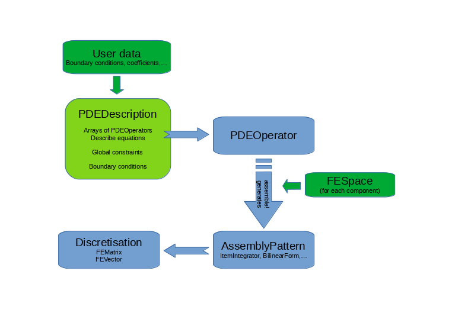

# PDE Description

## Purpose

Although a more manually low-level assembly of your problem is possible, it is advised to describe it in the form of a PDEDescription
to get access to certain automated mechanisms (in particular concerning fixpoint solvers).

The PDEDescription has similarities with the weak form of your problem (without time derivatives that are added separately by TimeControlSolver) and in general does not need any information on the discretisation at this point.

The following flow chart summarises the assembly process during the solve. The green parts can be modified/specified by the user, the rest is handled automatically. For details on steering the solver see [PDE Solvers](@ref)

 


```@docs
PDEDescription
Base.show(io::IO, PDE::PDEDescription)
```


## Creating/Extending a PDEDescription

Several add...! functions allow to extend the problems at any stage. There are several prototype PDEs documented on the [PDE Prototypes](@ref) page that can be used as a point of departure. Below is a list of functions that allows to initialise and extend a PDEDescription.

```@autodocs
Modules = [GradientRobustMultiPhysics]
Pages = ["pdedescription.jl"]
Order   = [:type, :function]
```
