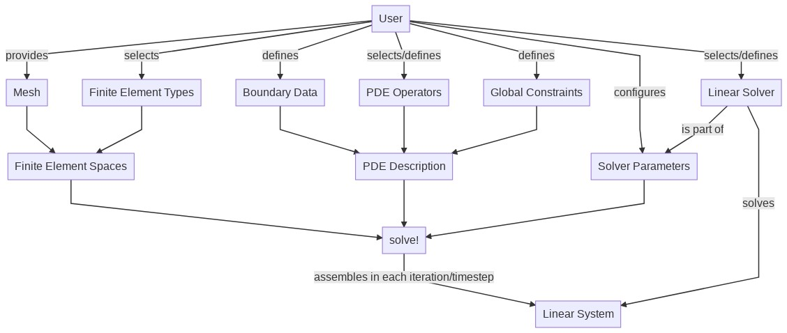

# PDE Description

## Purpose

The following flow chart visualizes the typical work flow for solving a PDE.

 

Central object is the PDEDescription which is given as a weak form of your problem (without time derivatives that are added separately by a TimeControlSolver) and usually does not need any information on the discretisation at this point (but of course can depend on region numbers).

Seperately the user provides a mesh and selects suitable finite element spaces on it. The PDEDescription and the Finite Element information is passed to the solver which
(after an inspection of all the problem features) descides on a solver strategy (directly or fixed-point). In each iteration a linear system of equations is assembled and then solved by a linear solver.

Automatic differentiation enters on the PDEDescription level. Nonlinear operators can be differentiated automatically and the necessary terms for a Newton update enter the PDEDescription.

Also, if preferred or needed, a low-level assembly of the linear system is possible as each operator can be assembled separately.

Below the PDEDescription type is detailed. Its ingredients (PDEOperators, boundary conditions, global constraints) are explained on the next pages.

```@docs
PDEDescription
Base.show(io::IO, PDE::PDEDescription)
```


## Creating/Extending a PDEDescription

Several add...! functions allow to extend the problems at any stage. There are several prototype PDEs documented on the [PDE Prototypes](@ref) page that can be used as a point of departure. Below is a list of functions that allows to initialise and extend a PDEDescription.

```@autodocs
Modules = [GradientRobustMultiPhysics]
Pages = ["pdedescription.jl"]
Order   = [:type, :function]
```
